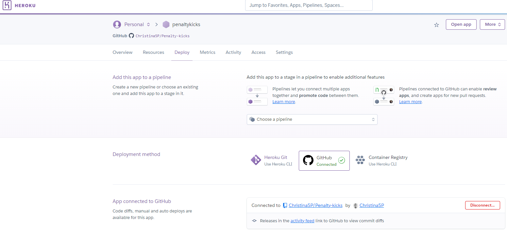
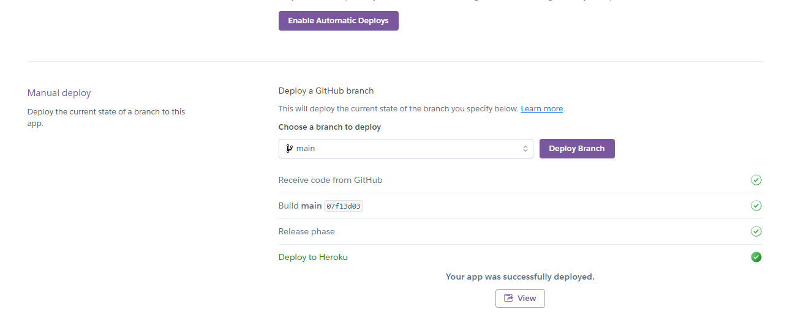
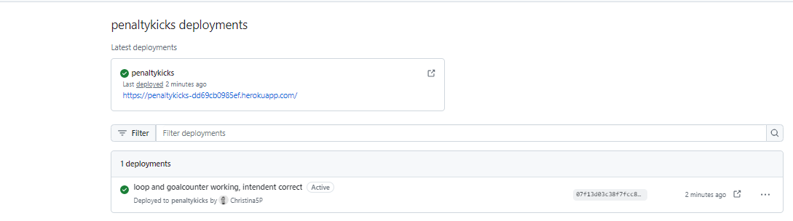

# Penalty Kicks

## Contents

## How to play

## Flowchart

## Features

### Example of error 

## Technologies
Python 
Github
Heroku
Pyfiglet
Colorama

## Testing

## Deployment
At first you commit everything to GitHub
After that you log in to HEROKU and create a new app.
You connect the app to your repository in GitHub eith same name

I choose to make a manual deploy, so I can see that everything goes ok.

After you have deployed in HEROKU, you can visit your publish webside from GitHub

## Credits

## Acknowledgements

https://trinket.io/python/909d6c5804- inspiration penalty definition
https://www.giraffeacademy.com/programming-languages/python - tutoring of formatting
https://www.w3schools.com/python - tutoring of formatting
https://econowmics.com/python-penalty-kicks-simulator/ - function for penaltykicks
https://www.101computing.net/penalty-shootout/ - tutoring video
https://dcallanit.blogspot.com/2015/10/python-penalty-shoot-out.html - inspiration of penalty shoot game
https://www.asciiart.eu/ 
https://mplsoccer.readthedocs.io/en/latest/gallery/pitch_setup/plot_pitches.html - soccer pitch
https://www.youtube.com/watch?app=desktop&v=u51Zjlnui4Y - tutoring colurs in Python
https://docs.python.org/3/tutorial/errors.html - syntax error
https://www.youtube.com/watch?v=Ovwr_Wt-og0 - tutoring pyfiglet

